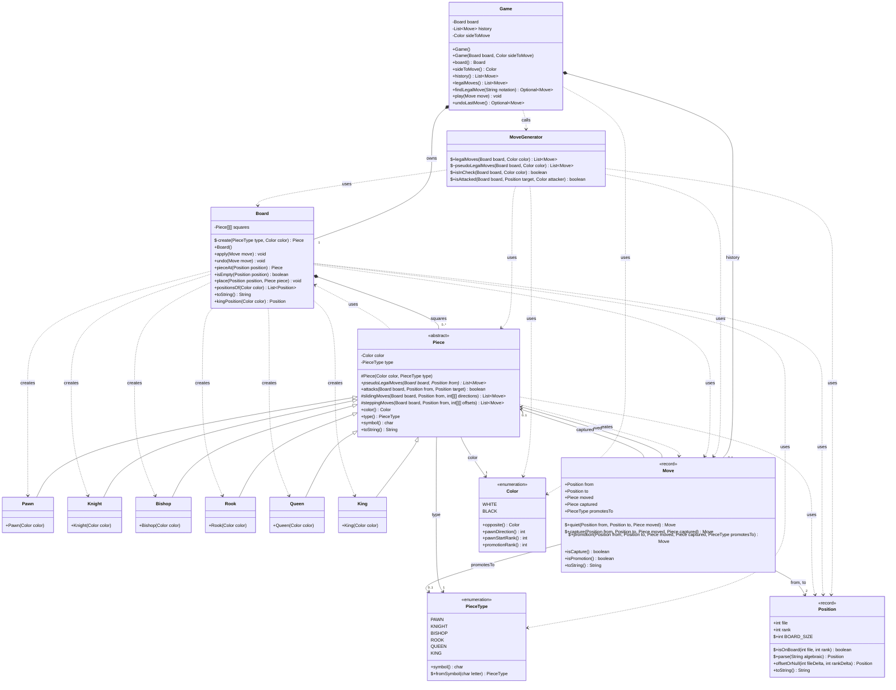
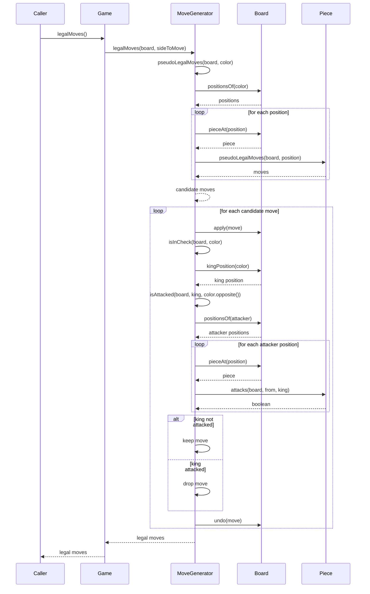

# Design

## Class diagram — `engine` and `model`

```mermaid
classDiagram
    class Game {
        -Board board
        -List~Move~ history
        -Color sideToMove
        +Game()
        +Game(Board board, Color sideToMove)
        +board() Board
        +sideToMove() Color
        +history() List~Move~
        +legalMoves() List~Move~
        +findLegalMove(String notation) Optional~Move~
        +play(Move move) void
        +undoLastMove() Optional~Move~
    }

    class MoveGenerator {
        $+legalMoves(Board board, Color color) List~Move~
        $~pseudoLegalMoves(Board board, Color color) List~Move~
        $+isInCheck(Board board, Color color) boolean
        $+isAttacked(Board board, Position target, Color attacker) boolean
    }

    class Board {
        -Piece[][] squares
        $-create(PieceType type, Color color) Piece
        +Board()
        +apply(Move move) void
        +undo(Move move) void
        +pieceAt(Position position) Piece
        +isEmpty(Position position) boolean
        +place(Position position, Piece piece) void
        +positionsOf(Color color) List~Position~
        +toString() String
        +kingPosition(Color color) Position
    }

    class Piece {
        <<abstract>>
        -Color color
        -PieceType type
        #Piece(Color color, PieceType type)
        +pseudoLegalMoves(Board board, Position from)* List~Move~
        +attacks(Board board, Position from, Position target) boolean
        #slidingMoves(Board board, Position from, int[][] directions) List~Move~
        #steppingMoves(Board board, Position from, int[][] offsets) List~Move~
        +color() Color
        +type() PieceType
        +symbol() char
        +toString() String
    }

    class Pawn {
        +Pawn(Color color)
    }
    class Knight {
        +Knight(Color color)
    }
    class Bishop {
        +Bishop(Color color)
    }
    class Rook {
        +Rook(Color color)
    }
    class Queen {
        +Queen(Color color)
    }
    class King {
        +King(Color color)
    }

    class Move {
        <<record>>
        +Position from
        +Position to
        +Piece moved
        +Piece captured
        +PieceType promotesTo
        $+quiet(Position from, Position to, Piece moved) Move
        $+capture(Position from, Position to, Piece moved, Piece captured) Move
        $+promotion(Position from, Position to, Piece moved, Piece captured, PieceType promotesTo) Move
        +isCapture() boolean
        +isPromotion() boolean
        +toString() String
    }

    class Position {
        <<record>>
        +int file
        +int rank
        $+int BOARD_SIZE
        $+isOnBoard(int file, int rank) boolean
        $+parse(String algebraic) Position
        +offsetOrNull(int fileDelta, int rankDelta) Position
        +toString() String
    }

    class Color {
        <<enumeration>>
        WHITE
        BLACK
        +opposite() Color
        +pawnDirection() int
        +pawnStartRank() int
        +promotionRank() int
    }

    class PieceType {
        <<enumeration>>
        PAWN
        KNIGHT
        BISHOP
        ROOK
        QUEEN
        KING
        +symbol() char
        $+fromSymbol(char letter) PieceType
    }

    Piece <|-- Pawn
    Piece <|-- Knight
    Piece <|-- Bishop
    Piece <|-- Rook
    Piece <|-- Queen
    Piece <|-- King

    Game *-- "1" Board : owns
    Game *-- "0..*" Move : history
    Game ..> MoveGenerator : calls
    Game ..> Color : uses

    MoveGenerator ..> Board : uses
    MoveGenerator ..> Color : uses
    MoveGenerator ..> Position : uses
    MoveGenerator ..> Piece : uses
    MoveGenerator ..> Move : uses

    Board *-- "0..*" Piece : squares
    Board ..> Position : uses
    Board ..> Move : uses
    Board ..> PieceType : uses
    Board ..> Pawn : creates
    Board ..> Knight : creates
    Board ..> Bishop : creates
    Board ..> Rook : creates
    Board ..> Queen : creates
    Board ..> King : creates

    Piece --> "1" Color : color
    Piece --> "1" PieceType : type
    Piece ..> Board : uses
    Piece ..> Position : uses
    Piece ..> Move : creates

    Move --> "2" Position : from, to
    Move --> "1" Piece : moved
    Move --> "0..1" Piece : captured
    Move --> "0..1" PieceType : promotesTo
```

## Sequence diagram — `game.legalMoves()`

```mermaid
sequenceDiagram
    participant Caller
    participant Game
    participant MoveGenerator
    participant Board
    participant Piece

    Caller->>Game: legalMoves()
    Game->>MoveGenerator: legalMoves(board, sideToMove)

    MoveGenerator->>MoveGenerator: pseudoLegalMoves(board, color)
    MoveGenerator->>Board: positionsOf(color)
    Board-->>MoveGenerator: positions

    loop for each position
        MoveGenerator->>Board: pieceAt(position)
        Board-->>MoveGenerator: piece
        MoveGenerator->>Piece: pseudoLegalMoves(board, position)
        Piece-->>MoveGenerator: moves
    end

    MoveGenerator-->>MoveGenerator: candidate moves

    loop for each candidate move
        MoveGenerator->>Board: apply(move)

        MoveGenerator->>MoveGenerator: isInCheck(board, color)
        MoveGenerator->>Board: kingPosition(color)
        Board-->>MoveGenerator: king position

        MoveGenerator->>MoveGenerator: isAttacked(board, king, color.opposite())
        MoveGenerator->>Board: positionsOf(attacker)
        Board-->>MoveGenerator: attacker positions

        loop for each attacker position
            MoveGenerator->>Board: pieceAt(position)
            Board-->>MoveGenerator: piece
            MoveGenerator->>Piece: attacks(board, from, king)
            Piece-->>MoveGenerator: boolean
        end

        alt king not attacked
            MoveGenerator->>MoveGenerator: keep move
        else king attacked
            MoveGenerator->>MoveGenerator: drop move
        end

        MoveGenerator->>Board: undo(move)
    end

    MoveGenerator-->>Game: legal moves
    Game-->>Caller: legal moves
```
